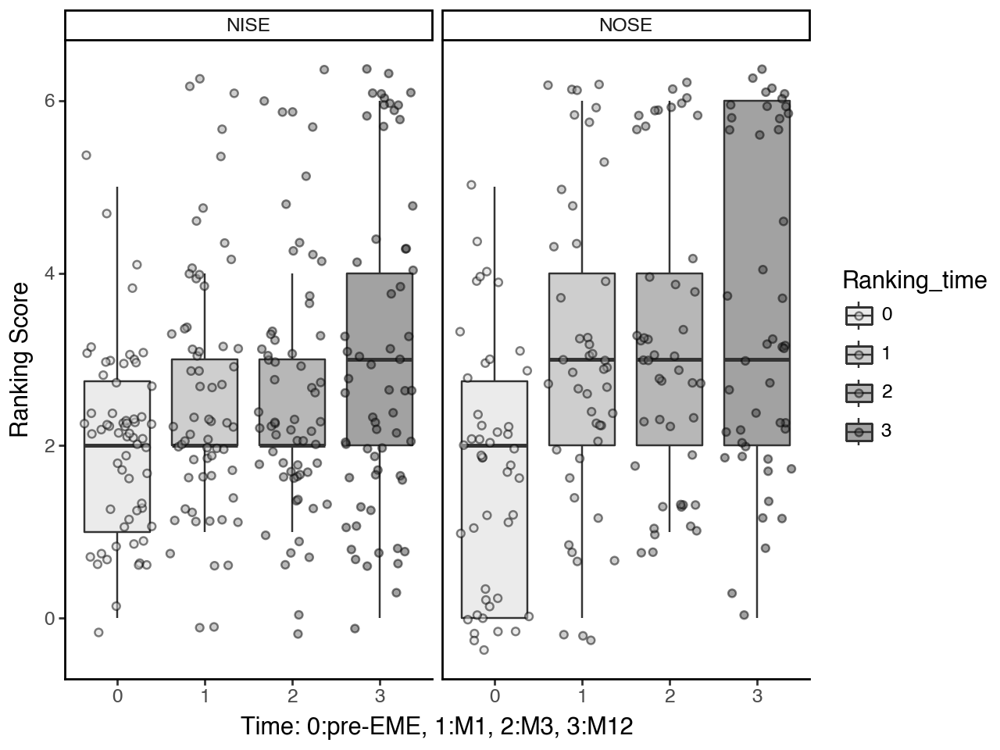
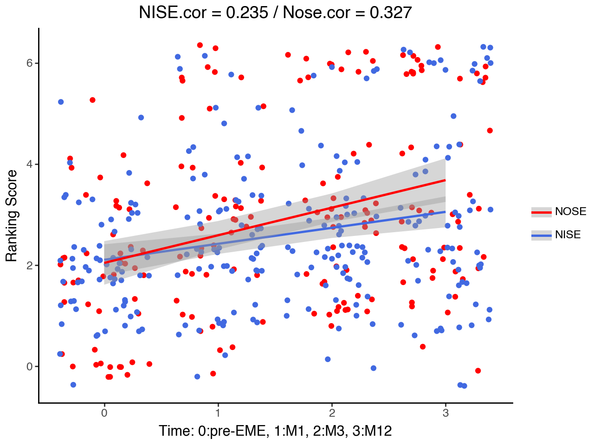
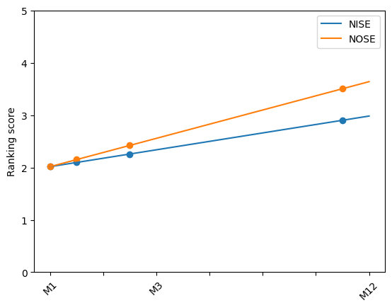
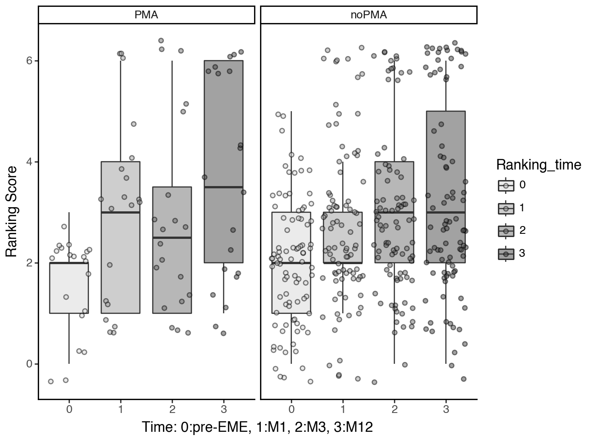
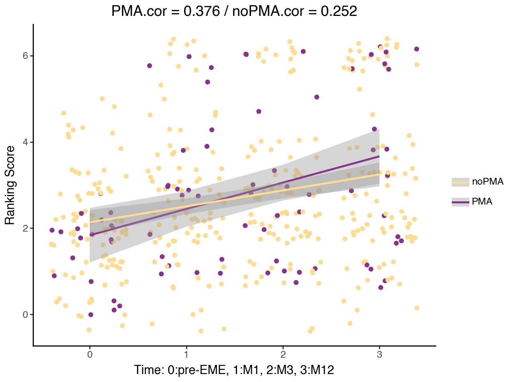
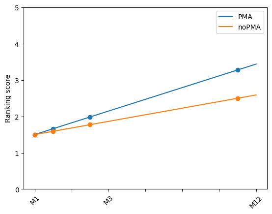
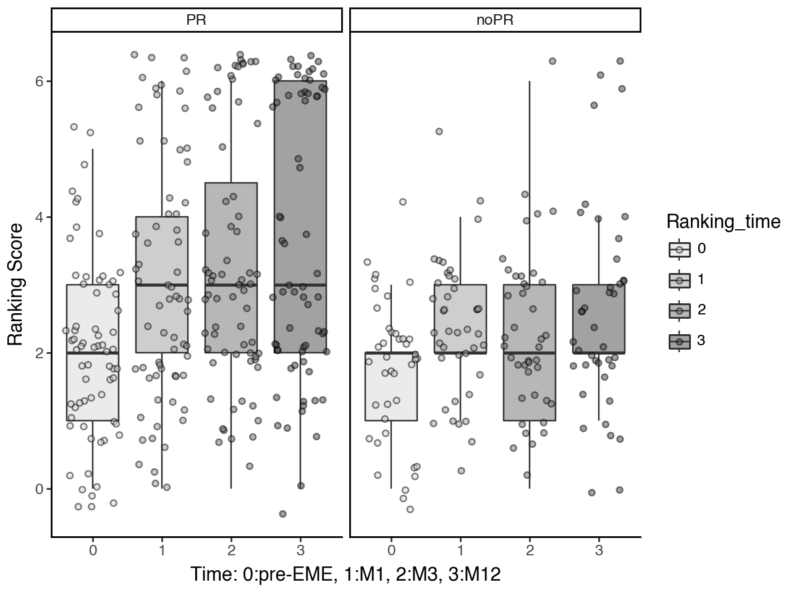
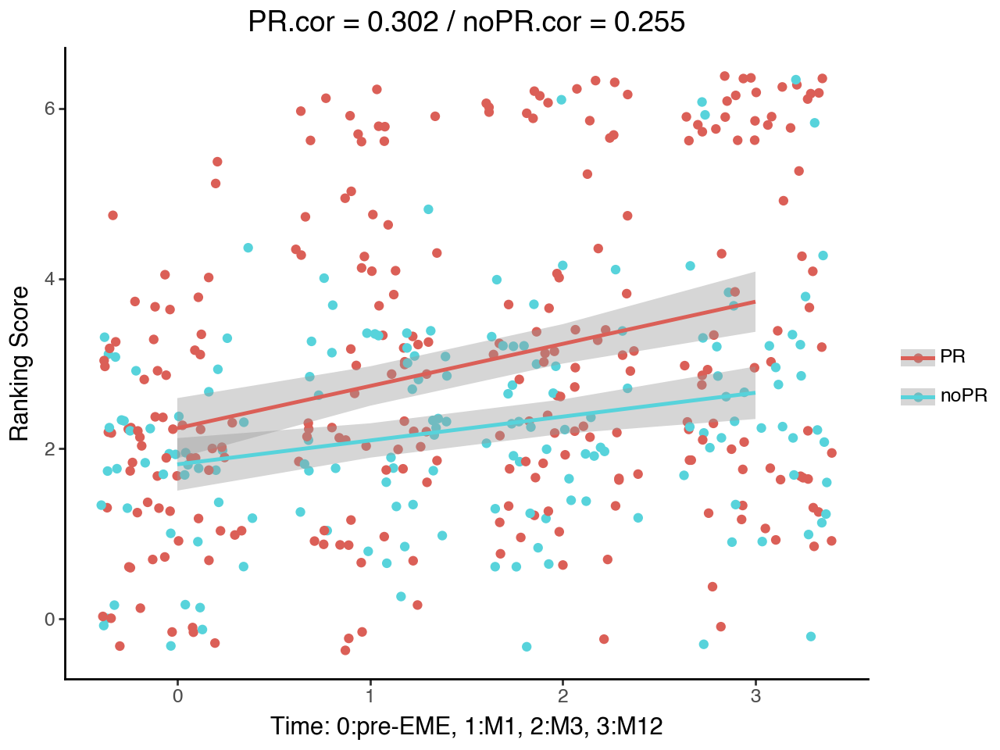
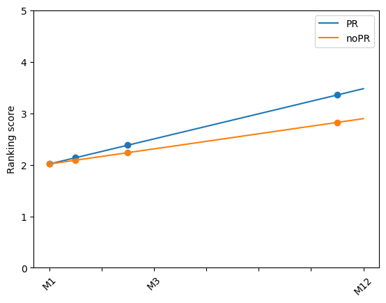

# Specific Profiles of New-Onset (NOSE) vs Non-Inaugural (NISE) Status Epilepticus: From Diagnosis to One-Year Outcome

## 📄 Description
While new-onset status epilepticus (NOSE) is a harbinger of chronic epilepsy, prospective medical data are sparse in terms of specifying whether the evolution of status epilepticus (SE) and seizure expression in NOSE resembles what occurs in patients who have already been diagnosed with epilepsy (non-inaugural SE (NISE)) in all aspects apart from its inaugural nature. 

Our aim was to compare the clinical, MRI and EEG features that could distinguish NOSE from NISE. We conducted a prospective monocentric study and included all patients ≥ 18 years. 58 admitted for SE over a 6-month period.

109 patients were included: 63 NISE and 46 NOSE cases. Despite similar modified Rankin scores before SE, several aspects of clinical history distinguished NOSE from NISE patients. NOSE patients tended to be older, frequently had neurological comorbidity and pre-existing cognitive decline but a similar prevalence of alcohol consumption to NISE patients.

NOSE and NISE evolve in the same proportions as refractory SE (62.5% NOSE, 61% NISE) and share common features such as the same incidence (33% NOSE, 42% NISE, p=0.53) and volumes of peri-ictal abnormalities on MRI. However, in NOSE patients we observed greater non-convulsive semiology (21.7% NOSE, 6% NISE, p=0.02), more periodic lateral discharges on EEG (p=0.004), later diagnosis and higher severity according to STESS and EMSE scales (p<0.0001). Mortality occurred in 32.6% of NOSE patients and 21% of NISE patients at one year (p=0.19) but with different causes of death occurring at different time points: more early deaths directly linked to SE at one month occurred in the NOSE group while there were more remote deaths linked to causal brain lesions in the NISE group at final follow-up. In survivors, 43.6% of the NOSE cases developed into epilepsy.

Despite acute causal brain lesions, the novelty related to its inaugural nature is still too often associated with a delay in diagnosing SE and a poorer outcome, which justifies the need to more clearly specify the various types of SE to constantly raise awareness among clinicians. These results highlight the relevance of including novelty-related criteria, clinical history and temporality of occurrence in the nosology of SE.

## ⚒️ Installation

### Prerequisites
- Python 3.11
- Python libraries
    ```sh
    pip install -r requirements.txt
    ```
    
## 📝 Usage
The notebook [analyses.ipynb](https://github.com/LudovicGardy/epicea_epilepsy/blob/main/analyses.ipynb) presents the data and the analyses performed for the article [1].

### Methods: statistical analyses
To compare the NOSE and NISE groups, we used the Chi-2 Test for qualitative variables, except when the theoretical numbers were less than 5, in which case the Fisher Test was used. To compare quantitative variables, we used the Wilcoxon Test. To limit the risk of type-1 errors associated with multiple comparisons, we corrected the alpha values using the Bonferroni method. The alpha values to be considered are indicated below the figures or tables (in general, the alpha value = 0.05/90). Due to the inherent heterogeneity of clinical data and the multiple comparisons made, we considered “tendencies” for p-value <0.05 but above the corrected threshold. We only considered significant p-values below the corrected alpha-values. For post hoc analyses, a Tukey Test was computed (p-values automatically adjusted for multiple comparisons).

To study the impact on outcome (mRS) at different timestamps for predictive factors such as the presence or absence of PMA, drug resistance or status epilepticus, we performed multiple linear regressions. We used linear mixed-effects models in which the variable "patient" was considered a random effect. The variables "measurement time" (baseline, first month, third month, twelfth month), drug resistance (1/0), with or without PMA (1/0) and new onset status epilepticus (1/0) were considered as fixed effects. Finally, Pearson correlations were performed. Corrected p-value was considered for the significance threshold for linear mixed-effect models and the Pearson correlation was 0.017 (0.05/3).

### Results

#### Status epilepticus: 0 vs 1 - effect over time
|  |  |  |
|:---------------------:|:---------------------:|:---------------------:|

#### MRI anomaly: 0 vs 1 - effect over time
|  |  |  |
|:---------------------:|:---------------------:|:---------------------:|


#### Pharmacoresistance: 0 vs 1 - effect over time
|  |  |  |
|:---------------------:|:---------------------:|:---------------------:|

## 📚 References
[1] Specific Profiles of New-Onset (NOSE) vs Non-Inaugural (NISE) Status Epilepticus: From Diagnosis to One-Year Outcome", Frontiers in Neurology (03 February 2023).

## ✍️ Affiliations
- Marie Benaiteau, MD [1,2*]
- Luc Valton, MD [1, 3]
- **Ludovic Gardy**, PhD [3, 5]
- Marie Denuelle, MD [2,3]
- Rachel Debs, MD [2]
- Valentin Wucher [1,4]
- Florence Rulquin, MD [2]
- Emmanuel J. Barbeau, PhD [3,5]
- Fabrice Bonneville, MD, PhD [5,6,7]
- Jérémie Pariente, MD, PhD [2,5,6]
- Jonathan Curot, MD, PhD [2,3,5]

1. French Paraneoplastic Neurological Syndromes and Autoimmune Encephalitis Reference Center, University of Lyon, Neurology Hospital, Bron, France.
2. Neurology Department, Toulouse University Hospital, Toulouse, France.
3. Brain and Cognition Research Center (CerCo), French National Scientific Research Center, UMR5549, Toulouse, France.
4. Synaptopathies and Autoantibodies (SynatAc) Team, NeuroMyoGene-MeLis Institute, INSERM U1314/CNRS UMR 5284, University of Lyon, France.
5. Faculty of Health, University of Toulouse-Paul Sabatier, Toulouse, France.
6. INSERM, U1214, Toulouse Neuro Imaging Center (ToNIC), Toulouse, France.
7. Neuroradiology Department, Toulouse University Hospital, Toulouse, France.

## 👤 Author
- LinkedIn: [Ludovic Gardy](https://www.linkedin.com/in/ludovic-gardy/)
- Doctoral thesis: [PDF](http://thesesups.ups-tlse.fr/5164/1/2021TOU30190.pdf)